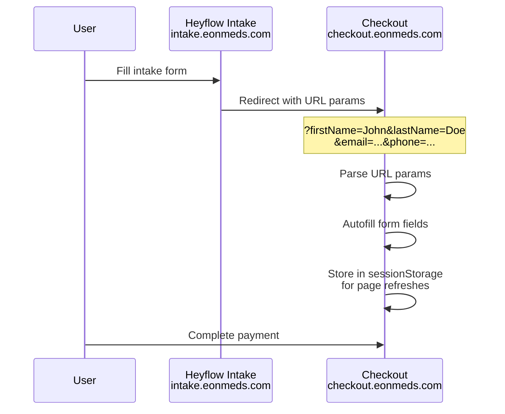

# Heyflow to Checkout Integration Plan

## Architecture Overview



## Data Flow

| Field | Heyflow Variable | URL Parameter | Checkout Field |

|-------|------------------|---------------|----------------|

| First Name | `{firstName}` | `firstName` | `patientData.firstName` |

| Last Name | `{lastName}` | `lastName` | `patientData.lastName` |

| Email | `{email}` | `email` | `patientData.email` |

| Phone | `{phone}` | `phone` | `patientData.phone` |

| DOB | `{dateOfBirth}` | `dob` | `patientData.dob` |

| Address Line 1 | `{address}` | `address1` | `shippingAddress.addressLine1` |

| City | `{city}` | `city` | `shippingAddress.city` |

| State | `{state}` | `state` | `shippingAddress.state` |

| ZIP | `{zipCode}` | `zip` | `shippingAddress.zipCode` |

## Implementation Steps

### Step 1: Configure Heyflow Redirect URL

In Heyflow's flow settings, set the completion redirect URL to:

```
https://checkout.eonmeds.com/?firstName={firstName}&lastName={lastName}&email={email}&phone={phone}&dob={dateOfBirth}&address1={address}&city={city}&state={state}&zip={zipCode}
```

### Step 2: Create URL Parameter Parser Utility

Create a new utility file to parse and validate incoming parameters:

**New file:** `src/utils/urlParams.ts`

- Parse URL search params on page load
- Validate/sanitize inputs (prevent XSS)
- Return typed object with patient data
- Clear sensitive params from URL after reading (clean URL)

### Step 3: Update Checkout Page State Initialization

Modify `src/features/checkout/GLP1CheckoutPageImproved.tsx`:

- Import the URL parser utility
- Initialize `patientData` and `shippingAddress` state from URL params
- Store parsed data in `sessionStorage` for persistence across refreshes
- On mount: check URL params first, then sessionStorage fallback

### Step 4: Add SessionStorage Persistence

Store prefilled data in sessionStorage so it survives:

- Page refreshes
- Navigation within checkout
- Form validation errors

Key: `eonmeds_checkout_prefill`

### Step 5: Pre-select Medication (Optional)

If Heyflow collects medication preference, pass it too:

```
&medication=semaglutide  // or tirzepatide
&plan=3month             // monthly, 3month, 6month
```

## Security Considerations

1. **URL Parameter Sanitization** - Escape all inputs to prevent XSS
2. **No PHI in URLs** - Only personal info, no medical data (URLs get logged)
3. **Clear URL After Parse** - Use `history.replaceState()` to remove params from browser history
4. **SessionStorage Expiry** - Clear after successful payment or 24h timeout

## Files to Modify

1. **Create:** `src/utils/urlParams.ts` - Parser utility
2. **Modify:** `src/features/checkout/GLP1CheckoutPageImproved.tsx` - Initialize state from params
3. **Modify:** `src/App.tsx` or router - Handle URL params on entry (if needed)

## Testing

1. Test URL: `https://checkout.eonmeds.com/?firstName=Test&lastName=User&email=test@example.com`
2. Verify fields are autofilled
3. Verify URL is cleaned after parsing
4. Verify data persists on page refresh
5. Verify data clears after successful payment